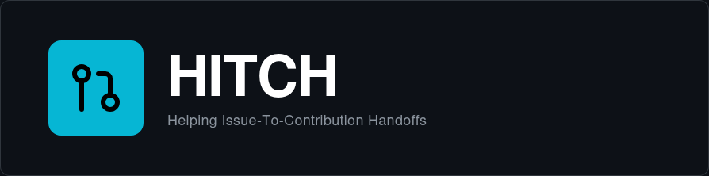

[](https://h-itch.vercel.app)
[](https://github.com/fawez9/hitch)
[](https://github.com/fawez9/hitch/actions/workflows/ci.yml)
[](LICENSE)

---

## What is HITCH ?

Finding the right issue to work on shouldn't be the hardest part of contributing to open source. Hitch cuts through the noise by letting you filter GitHub issues by programming language, labels (like "good first issue" or "bug"), and keywords—all with lightning-fast client-side filtering.

Whether you're a first-time contributor or a seasoned developer looking for your next project, Hitch helps you find issues worth your time.

## Why HITCH ?

Think of Hitch as **hitchhiking for developers**. When you hitchhike, you're looking for a ride that's going your way. Hitch does the same thing for open-source contributions—it helps you catch a ride on projects that match your skills and interests, getting you from "I want to contribute" to "I'm contributing" faster.

---

## ✨ Features

- **Smart Issue Discovery** – Search across GitHub with real-time filtering
- **Multi-Language Support** – Filter by your preferred programming languages
- **Label-Based Filtering** – Find bugs, enhancements, good first issues, and more
- **Keyword Search** – Search issue titles and repo names instantly

## 🔮 Coming Soon

This is version 1.0—fully functional and ready to use, but we're just getting started. Here's what's next:

- 🔑 **Authentication** – Sign in to personalize your experience
- 💾 **Saved Searches** – Bookmark your favorite filters + custom labels
- ⭐ **Issue Bookmarking** – Track issues you want to contribute to
- 🛠 **Contribution Tracking** – Follow your open-source journey

> **_Star ⭐ this repo to get notified when new features drop!_**

---

## 🚀 Quick Start

### Prerequisites

- Node.js v20 or higher
- npm v10 or higher
- GitHub Personal Access Token (optional but recommended)

### Installation

```bash
git clone https://github.com/fawez9/hitch.git
cd hitch
npm install
```

### Environment Setup

Create a `.env` file in the root directory:

```env
SECRET_TOKEN=your_github_personal_access_token
```

**Why use a token?** Without one, you're limited to 60 GitHub API requests per hour. With a token, you get 5,000 requests per hour. [Generate your token here](https://github.com/settings/tokens) (no special permissions needed).

### Development

```bash
npm run dev
```

Open [http://localhost:3000](http://localhost:3000) in your browser.

### Production Build

```bash
npm run build
npm start
```

---

## 🛠️ Built With

**Core:** Next.js 16 (React 19, App Router) • TypeScript • GitHub REST API v3

**Styling:** Tailwind CSS • Lucide React • React Icons

**Testing:** Vitest • React Testing Library

**State:** React Hooks (useState, useEffect, custom hooks)

---

## 📂 Project Structure

```
hitch/
├── src/
│   ├── app/                    # Next.js pages & API routes
│   │   ├── api/v1/issues/      # GitHub API integration
│   │   ├── page.tsx            # Home page
│   │   └── layout.tsx          # Root layout
│   ├── components/             # UI components
│   │   ├── FilterPanel.tsx     # Search & filter controls
│   │   ├── IssueCard.tsx       # Issue display card
│   │   ├── Pagination.tsx      # Results pagination
│   │   └── HomePage.tsx        # Main page component
│   ├── hooks/                  # Custom React hooks
│   │   └── useIssueSearch.ts   # Issue search logic
│   └── lib/                    # Utility functions
├── packages/
│   └── core/                   # Framework-agnostic logic
│       └── src/issues/
│           ├── search.ts       # Search implementation
│           ├── mapper.ts       # Data transformation
│           ├── queryBuilder.ts # GitHub query builder
│           └── types.ts        # TypeScript types
├── tests/                      # Test suites
│   ├── core/                   # Business logic tests
│   ├── components/             # UI component tests
│   └── hooks/                  # Hook tests
└── public/                     # Static assets
```

---

## 🧪 Testing

### Run All Tests

```bash
npm test
```

### Run Specific Test Suites

```bash
npm run test:units-core          # Core business logic
npm run test:units-components    # UI components
npm run test:units-hooks         # Custom hooks
npm run test:integrations        # Integration tests (requires SECRET_TOKEN)
```

### Watch Mode

```bash
npm run test:watch
```

---

## 📜 Available Commands

| Command              | Description                  |
| -------------------- | ---------------------------- |
| `npm run dev`        | Start development server     |
| `npm run build`      | Build for production         |
| `npm start`          | Start production server      |
| `npm run lint`       | Run ESLint                   |
| `npm run typecheck`  | Run TypeScript type checking |
| `npm test`           | Run all tests                |
| `npm run test:watch` | Run tests in watch mode      |

---

## 🤝 Contributing

We'd love your help making Hitch better! Here's how to contribute:

### Getting Started

1. **Fork the repository**
2. **Create a feature branch**
   ```bash
   git checkout -b feature/your-feature-name
   ```
3. **Make your changes**
4. **Commit with a clear message**
   ```bash
   git commit -m "feat: add your feature description"
   ```
5. **Push to your fork**
   ```bash
   git push origin feature/your-feature-name
   ```
6. **Open a Pull Request**

### Before Submitting

Make sure everything passes:

```bash
npm run lint          # Check code style
npm run typecheck     # Verify TypeScript
npm test              # Run all tests
npm run build         # Ensure production build works
```

### Commit Convention

We follow [Conventional Commits](https://www.conventionalcommits.org/):

- `feat:` New features
- `fix:` Bug fixes
- `docs:` Documentation updates
- `test:` Test additions or updates
- `refactor:` Code refactoring
- `chore:` Maintenance tasks

---

## 📝 License

This project is licensed under the [MIT License](LICENSE).

---

## 🙏 Acknowledgments

Built with love for the open-source community using:

- [Next.js](https://nextjs.org/) – The React framework for production
- [GitHub REST API](https://docs.github.com/en/rest) – Powering our issue discovery
- [Tailwind CSS](https://tailwindcss.com/) – Beautiful, utility-first styling

---

<div align="center">

**Open source and community-maintained.**

_Helping you find your next contribution, one issue at a time_

[Website](https://h-itch.vercel.app) • [Report Bug](https://github.com/fawez9/hitch/issues) • [Request Feature](https://github.com/fawez9/hitch/issues)

</div>
